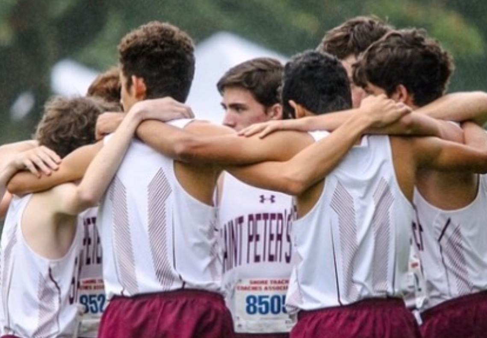

I've recently had the urge to document my life. I thought about vlogging, but editing is always a pain during the school year. (if you're interested, some of my videos can be found [here](https://youtube.com/samayshamdasani)). I then created an email-to-journal-entry service for myself, but that didn't last long as I kept on forgetting to send myself emails.

I don't know what I'm going to do, but I'm starting off by journaling in a Google Doc everyday (I ordered one of those cool dot-grid notebooks, but it's taking forever to ship from China...). Even though I'm not a great writer, I think that there is value in reflection. It'll also be pretty amazing to read my journal entries in a couple years so I can bring myself back to a specific experience.

Along with documenting my life, I also want to share more content on my blog. Therefore, I've decided to put a little post together with some awesome moments of 2018 and my goals for this new year.

### January 2018

#### Extempore Speech Competition

Every year in January, I participate in a speech competition at my cultural school. Since I was in the 11th grade, we were required to deliver the speech extemporaneously. With just an hour to prepare, I gave a two minute talk on "karma yoga", or the path of unselfish action in Hinduism. Out of my class of nine students, I won 2nd place. This year, my class is presenting the "Symposium" on our self-development throughout the past thirteen years as a result of a Vedantic education.

### February 2018

#### PennApps (Camlytics)

Later that month, I arrived at the University of Pennsylvania for PennApps XVII, where my team and I built [Camlytics](https://devpost.com/software/camlytics) — an analytics platform for retail stores using image recognition.

### April 2018

#### Mime

Believe it or not, I'm actually a mime at my cultural school. This year, our show was entitled "The Power of Youth" and it took place in April.

### May 2018

#### Spirit Award

I'm incredibly grateful to have received the Spirit Award at my school last spring. From the Prep website: "The award celebrates young men who model for our entire community the qualities and values that define a Prep student—the characteristics outlined in our mission statement and the Grad at Grad which speak about Prep’s desire to form men who are open to growth, intellectually competent, religious, loving, and committed to doing justice."

#### MakeSPP

On May 26th, a few friends and I threw a [huge hackathon](https://makespp.com) at my high school. It was a movie.

### June 2018

#### Apple WWDC + California

I was psyched to have had the opportunity to travel to San Jose for Apple's WWDC Conference. See my [California](https://shamdasani.org/cali) post for my experiences with Apple and the Valley.

### August 2018

#### Enlight

Over this past summer, I completely revamped Enlight into an educational platform where users can login, upvote, comment, chat, and even submit their own programming projects.

#### Internship @ IFF

Over the summer, I got a chance to experience software development at International Flavors & Fragnances. My project involved co-developing a smart mirror with facial and speech recognition for executives to gain access to financial insights of the company. We used Python, Node.js, wit.ai, and Google’s Text-to-Speech APIs to create the software for the mirror.

The internship was a great learning experience for me not only in the technical aspect, but I was also able to learn more about the (very slow-paced) corporate world.

### September 2018

#### PennApps (SafeFront)

At PennApps Retro, my team and I built [SafeFront](https://devpost.com/software/safefront), a next-generation emergency response system utilizing AI/ML.

#### Prep App

Although students at my high school have access to online grades, calendars, and schedules, we still had to pull out our heavy laptops and search for what we needed. That's why I created the [Saint Peter's Prep mobile application](https://itunes.apple.com/us/app/saint-peters-prep/id1382439636?mt=8) for iOS and Android.

### November 2018

#### Cross Country

It was a fun season. Even though I didn't train as hard in the summer as I wanted to, I still did well — earning a PR of 16:46 at Counties. We made it to MOCs (NJ Meet of Champions) again and had a great time working with the team make the dream work.

#### Issa Caption

I also got to work with my good friends [Nathan Leung](https://www.nathanhleung.com/) and Rohan Bhatia on [Issa Caption](https://issacaption.com), a ML-based caption generator app which was recently featured on [The Ringer](https://www.theringer.com/tech/2018/11/6/18067216/clever-instagram-captions-industry-apps-issa-caption) and [The Times of India](https://timesofindia.indiatimes.com/home/sunday-times/helping-people-write-instagram-captions-is-now-a-career/articleshow/67004294.cms).

### December 2018

#### Senior Year + College

As Senior year is more than halfway over (I graduate May 23rd), it's amazing to look back and see how the time has flown. I've certainly done a lot this year, and I hope to keep on learning, running, building, and sharing.

In college, I hope to study computer science & AI, but also explore my interests in psychology, philosophy, mathematics, spirituality, writing, & videography.

## Future

I'd like to read more. This means spending less time on Instagram, Twitter, and Reddit and actually picking up a physical book. _"A reader lives a thousand lives before he dies. The man who never reads lives only one."_ — George R.R. Martin

### Reading List

I'm currently ~130 pages in on Yuval Noah Harari's _Sapiens_, and he has made some pretty bold, but interesting arguments so far.

As the book interprets human history in the context of the Cognitive, Agricultual, and Scientific Revolutions, Harari speaks of imagined orders, shared myths, and human imagination outpacing human evolution. (I'll make a post exclusively focusing on this book soon...)

I also strongly reccommend reading Man's Search For Meaning by Viktor Frankl, which I read as a part of my "Pursuit of Purpose" English Class.

2019 Reading List:

* **Meditations**, Marcus Aurelius
* **Homo Deus**, Yuval Noah Harari
* **Principles**, Ray Dalio
* **Poor Charlie's Almanack**, Charlie Munger
* **The Wealth of Nations**, Adam Smith
* **How to Win Friends and Influence People**, Dale Carnegie
* **When Breath Becomes Air**, Paul Kalanithi
* **12 Rules for Life**, Jordan Peterson

### Meditation

I've always heard about the positive benefits of meditation — a calm mind free of distraction. I seek to experience such focus.

I'm trying to meditate, but it's really hard. Let's see what I can do. 5 minutes a day, everyday.

Peace. Hope you have a great 2019.

— Samay
 
