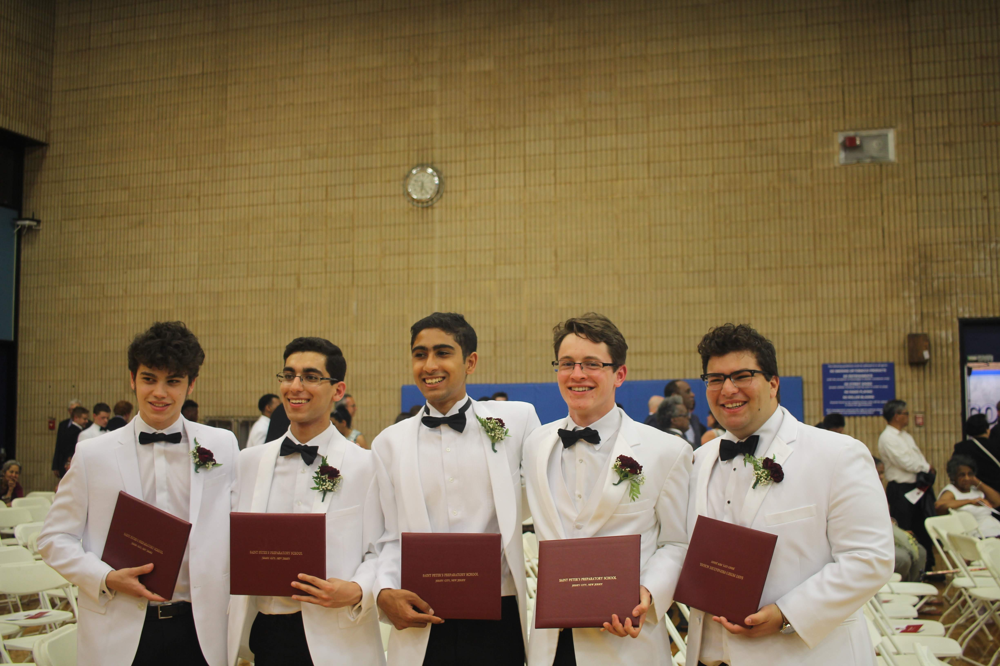

### Welcome to the 2019 Annual Report

**What a decade.** Where do I even _start_?

Well, I just finished my first semester at Michigan. It's been an amazing four months. I've met so many talented people, learned a ton, and experienced part of all that college has to offer.

Although I've missed my family and friends from back home, I've also enjoyed college life. While the food is alright and the dorms aren't nothing like home, the new experiences and friends make up for it!

But to be honest, I still just can't believe it. I'm 18, *officially* an adult. Everything's flying by.

Here are some metrics over the past year:

599 miles run 

I only recieved my GPS watch halfway throughout the year, so this doesn't speak for all my mileage! My total elevation gain was 25, 908 ft. (.9 of Mt. Everest!), which is pretty cool to look back at. 

142 <a href="https://twitter.com/samaysham">tweets</a> 

with 82k impressions and hundreds of engagements

8 <a href="https://instagram.com/samaysham">instagram</a> posts 

#influencer

37,337 minutes listened on spotify 

I share my account with my sister (sooo can't share my "top" artists here...)

5 books read 

(Meditiations, When Breath Becomes Air, How to Win Friends, 12 Rules for Life, Sapiens) I've invested my time in many blogs and podcasts, but did some reading too. I'd like to focus on reading more in 2020 (1 book/month).

365 journal entries 

This was my first year journalling! I'm so glad I did it and will countinue to do so. I started in October 2018 (early in my Senior year) on a Google Doc, but transitioned to a physical journal shortly thereafter.

## Let's break it down 

### January 2019

#### Symposium Presentation
12th grade presentation at my cultural school: From the "self" to the "SELF" 

### February 2019

#### Ended shoveling business
Since I was in the 7th grade, I've been shoveling driveways with friends — earning anywhere from a couple hundred to a thousand every season. It's how I bought my drone, computer, and camera! I won't be able to continue as I'll be in college every winter for the next four years.

### March 2019

#### Mom Prom
I'd say that this event is fairly unique to my all-boys Catholic high school — prom, but with our moms!

### April 2019

#### Directed the largest high-school hackathon in the tri-state area: MakeSPP 2.0

120+ students, 20+ mentors, raised $8k+ (https://makespp.com)

#### Commited to college 
I committed to the University of Michigan, Ann Arbor on April 12th, 2019.

I was absolutely ecstatic to find out that no-one had claimed the uniqname "samay". Shoot me an email sometime! :) [samay@umich.edu](mailto:samay@umich.edu)

#### Visited Michigan

#### Wrapped up track szn (and high school running career)

#### Mime

Participated in my cultural school's mime show on Mahatma Gandhi. 

#### Prom

### May 2019 

#### Parents threw me a suprise birthday / grad party (May 17th, 2019)

#### Graduated high school (May 23rd, 2019)

### June 2019

#### Graduated cultural school

#### Intern @ DataCamp in NYC
Software Engineer on the Growth Team (June - August). Worked at Empire State & World Trade Offices!

### July 2019

#### Attended summer camp at my cultural school

### August 2019

#### Counselor @ Northeast Kingdom Running Camp in Vermont
Made [this](https://www.youtube.com/watch?v=NTlUgJYtWtA) sick video.

#### Going away to college :(

#### Moved in to college on August 28th, 2019

### September 2019

#### Welcome Week 
"College"

<small>Here's a couple friends and I with the president of Michigan, Mark Schlissel! </small>

#### First Football Game: Michigan vs Army
110,000 people packed in one stadium is one exhilarating experience. 

#### Ran my first collegiate 8k race. 
29:09 for 5 miles (~5:50 pace)

### October 2019

#### Michigan Business Challenge w/ Jason, Varun, & Sean
We got cut the second round. Our idea was a data platform to centralize data sources and manipulation pipelines (esp. at startups).

### November 2019 

#### IASA Dance Show

#### Thanksgiving w/ fam

### December 2019

#### Survived my first semester 

- ENGR 151: Intermediate Computer Programming in C++
- COGSCI 200: Intro to Cognitive Science
- PHYSICS 140: Mechanics
- MATH 215: Multivariable Caluculus

It was tough, but a fun semester!

#### Holidays

There's nothing like being home for the holidays. 

### What's next

- [Ten Year Project](https://tenyearproject.glitch.me)

- [Enlight 3.0](https://enlight.nyc)

### 2020 Goals

- Write more. At least 12 blog posts (one / month)
- Vlog college experience. Make a few (2-4) videos every month. 
- Work out every day — no matter what. (Run, gym, body weight...)
- Make at least 30 minutes every day for personal time — meditation, reading, etc.
- Bootstrap a small, lifestyle business to bring in passive income 
