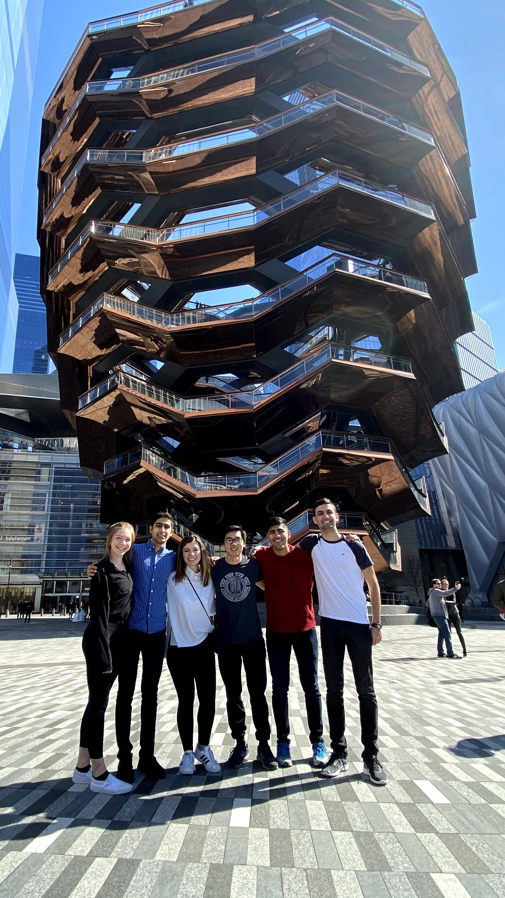
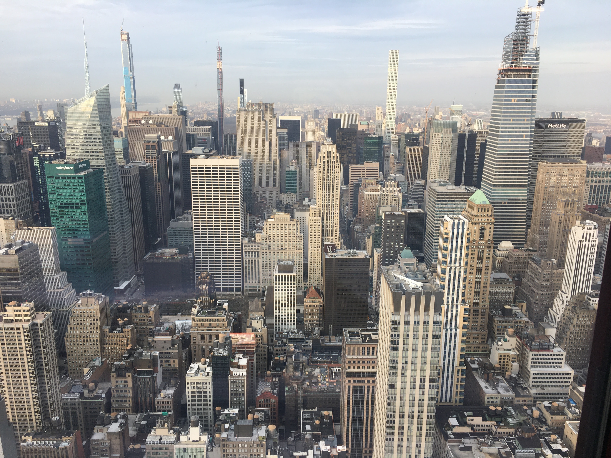
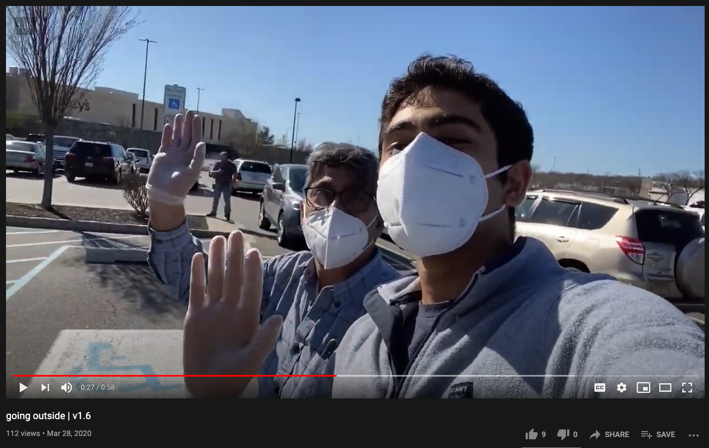
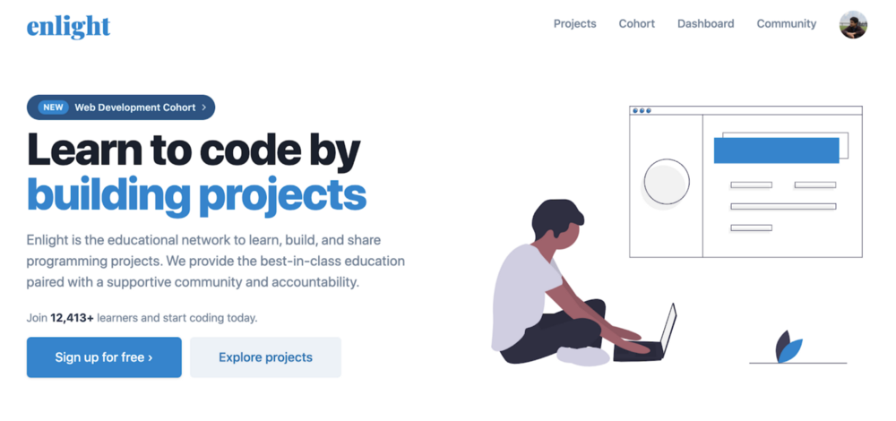
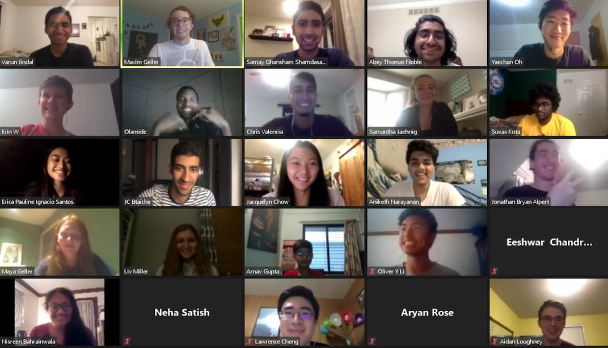

The past few months have felt like I’m witnessing history. Well, every second that passes is history.

But this feels different. This feels like the history that will be
highlighted in **bold text** in middle-school textbooks. The history that’s documented in movies and newspaper headlines. The history that everyone _remembers_.

I'm the type of person to document [everything](http://shamdasani.org/2019-review/). I love to take photos, create [videos](https://youtube.com/samayshamdasani), write in my journal, and share stories. I've spent a chunk of my time figuring out how I can possibly remember my life, or aspects of it. While there are many ways I do this, I find blogging really approachable, effective, and enduring. I can write a blog post and the words are forever shared on my corner of the [internet](https://shamdasani.org). 

### The beginning

This year started out great. I was headed back to the University of Michigan to continue classes for my second semester as a freshman studying computer science. Although my courses were challenging, I enjoyed the freedom that came with being a college student. I was able to prioritize my interests to focus on the things I was interested in, and that's what made the the first half of the semester so great.

I could trace the beginnings of the unexpected events that followed to one afternoon in the Bursley Dining Hall. During our chat over lunch, my friends brought up rumors of a new virus spreading throughout the country. I didn't think it was a big deal at all and overlooked it. Little did I know, however, that this would change my life in ways that I would have never imagined. 

When it was time for spring break, I invited some friends over back to my place in New Jersey and we ended up exploring my favorite city in the world, New York. At this point, none of us had any idea of what was to come. I was having a great time showing my friends the city experience. I took them around midtown and downtown through the subway and we ate at my favorite spots. We even got to go to the top of Empire State, where my former internship manager greeted me with a handshake, followed by the phrase "You know, we're told that we're not supposed to do that anymore." I politely laughed it off and we continued giving the tour to my friends. 

While the [news](https://www.usnews.com/news/best-states/new-york/articles/2020-03-14/new-york-reports-first-death-from-new-coronavirus) kept us updated on a virus that was just starting to make its mark, we were cautious, but didn’t know what to expect. Still, everything was normal — until we got back to school. Just four days after we got back to school, my university announced that all classes were to be held virtually. At first, (I’m not going to lie) I was *happy*. I thought school would be easier and I could work on things that interested me. I thought I was free. 

A few days later, however, the university announced that they encouraged everyone to go home. And that’s when it became real for me. Everything started to sink in. This was serious.

As I packed up all my things and left for home, I couldn’t help but think about how my reality changed in just a matter of hours. Yesterday, I was sitting in my programming class. Today, my freshman year was cut short. 

### Living during a pandemic

When I got home, I started to record [daily updates](https://youtube.com/samayshamdasani) by making videos and writing journal entries. I followed the news, government press briefings, and the markets closely, up to the point where I was focusing all my time on how the world was changing. Protests over racial equality, debates in politics, wildfires...it was one headline after the other.

Simultaneously, I adjusted to a new reality, one that was defined by Zoom calls for literally everything — school, in-person communities, hangouts, etc. My screen time tripled as a result. 

Now, this is an experience shared by many. Millions of people, including students and working adults, stayed at home in the midst of a time of immense uncertainty and transitioned to a virtual-first world. However, I'd argue that this wasn't the most significant event to me personally in the past few months — **it was what followed**. 

Personally, this was a tough transition. It felt like the world was falling apart, day by day. It's honestly really easy to be negative. In fact, I was — but that was because I had no idea what the opposite side of the table looked like. 

### Opportunity 

If there's one thing that I've learned over the past few months, it's that there is opportunity everywhere. The effects of the sudden change in circumstance at the time removed all possibilities of an internship, family vacation, or social meetups and obligations. In many respects, I was free. I was able to do whatever I wanted, but I didn't want to waste my time. I knew that I wanted to work on something special.

With this in mind, I was wrapping up my freshman year when my high school friend [Max](https://maximgeller.com) called me about an interesting opportunity — participating in his college's startup accelerator program, Georgia Tech Create X. 

As we thought of startups to work on, we came back to one of my personal side-projects, [Enlight](https://enlight.nyc). It was a community-driven site that hosted programming tutorials for web development and data science that I started four years ago. After agreeing that there's potential to grow the platform, I rallied together another good friend, [Varun](https://www.varunjindal.com/), and we quickly got to work. We ended up getting into the accelerator program with Enlight, and we were excited for what was to come. 

Over this past summer, we improved Enlight’s infrastructure, added new projects, grew our user base, cultivated our amazing community, and launched our cohort program.

Enlight Cohorts teaches web development by building three unique projects in two weeks, all within a supportive community of other builders. This isn’t an ordinary coding bootcamp or course, but instead an interactive cohort where learners attend live workshops and build projects. 

Our cohort program started as a way for us to learn more about how people learn to code so that we could improve engagement on the platform. Little did we know that we ended up discovering a whole different problem — staying motivated and accountable when you’re learning something new. 

Online course completion rates are [~5–15%](https://files.eric.ed.gov/fulltext/EJ1067937.pdf). Our completion rate for Enlight Cohorts is over 50%. One of the driving factors of this is the fact that everyone’s creations are automatically shared within our community, keeping everyone motivated and accountable. After a workshop or project deadline, members can view the projects their peers have created and drop a note of encouragement or a suggestion. In addition, our live and interactive learning experience, combined with support from mentors, is what sets the program apart. 

### Persistance 

This summer was amazing because it taught me the power of persistance. There were so many challenges that we navigated — whether it would be managing Zoom fatigue or grinding late nights to push to releases — but it was all worth it. We're continuing to grow Enlight as full-time students, which is both stressful but rewarding. 

I always come back to this summer to understand how I've grown. In all honesty, I believe that working with a team and seeing something through is perhaps one of the hardest things to do purely because of the obstacles in our way. 

However, it's at those times where I force myself to remember that there is always a *way*. That nothing is impossible. And that we just have to figure it out. It's that simple. 

### Back to history

While the world was (and still is) going through some tough times , I was able to find meaning in work. It's what got me through everything. 

In the face of an uncertainty, I managed to create my own personal history — and I wouldn't have wanted it any other way. 

<!-- Todo: 
- fix photos
- talk about persistance
- talk about a specific enlight story and outcome for someone & why I loved it 
 -->